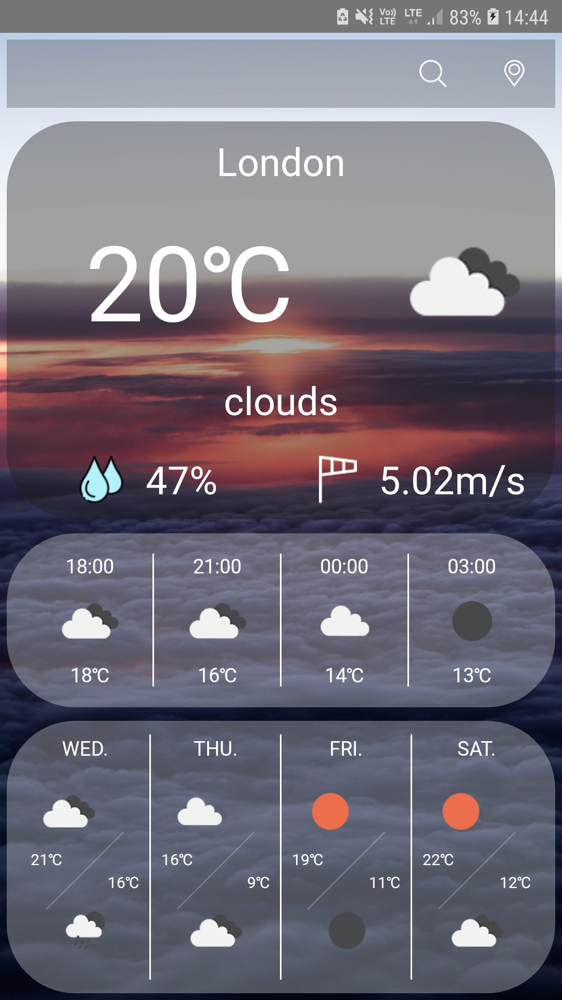

# Weather

> This is a React Native weather app that uses the OpenWather API to display the current weather data.

## General info

This application was created in order to increase my working knowledge of React Native and learning to retrieve data from the API.

## Screenshots

## Technologies

- React Native - version 0.63
- Jest - version 26.4

## Setup

- Follow the [React Native Guide](https://reactnative.dev/docs/environment-setup) for getting started building a project with native code.
- `git clone https://github.com/DamianJudek/WeatherApp.git` to clone this repository
- `npm install` to install dependencies
- `npx react-native run-android` to run app on your android phone

## Features

- Searching by city name or GPS lcoation
- Weather icons
- UI tests
- Animations

## Status

Project is _finished_

## Inspiration

Design inspired by Samsung Weather - what a beautiful app
